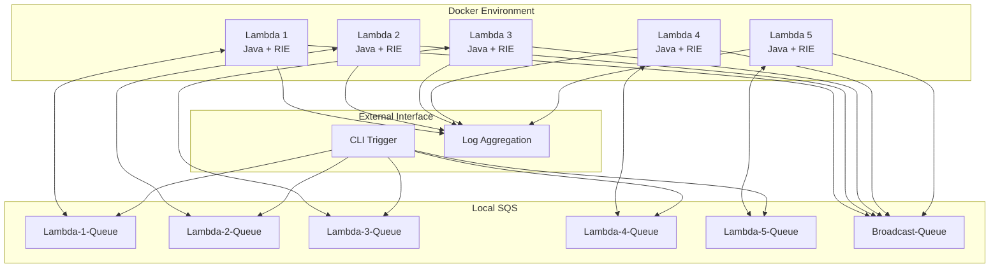

# Design Document

## Overview

The Lambda Consensus Federation is a distributed system that simulates AWS Lambda functions running locally in Docker containers with AWS Runtime Interface Emulator (RIE). The system implements a consensus protocol for maintaining a consistent global count across five Java-based Lambda functions that communicate exclusively through SQS queues.

The design follows a simplified Raft-like consensus algorithm adapted for the Lambda execution model, with quorum-based recovery mechanisms to handle node failures and restarts.

## Architecture

### High-Level Architecture



### Container Architecture

Each Lambda function runs in its own Docker container with:
- AWS Lambda Runtime Interface Emulator (RIE)
- Java 21 runtime environment
- AWS SDK for Java v2
- Custom consensus logic
- SQS client for message handling

### Communication Pattern

The system uses a hybrid communication model:
1. **Direct Queues**: Each Lambda has its own dedicated SQS queue for receiving messages
2. **Broadcast Queue**: A shared queue for system-wide announcements and recovery operations
3. **Point-to-Point**: Lambdas send messages directly to specific Lambda queues for consensus operations

## Components and Interfaces

### Core Components

#### 1. Lambda Function Handler
```java
public class ConsensusLambdaHandler implements RequestHandler<ConsensusRequest, ConsensusResponse> {
    private final ConsensusManager consensusManager;
    private final SQSMessageHandler sqsHandler;
    private final StateManager stateManager;
    
    @Override
    public ConsensusResponse handleRequest(ConsensusRequest request, Context context);
}
```

#### 2. Consensus Manager
Implements the core consensus algorithm:
- **Proposal Phase**: Initiates count increment proposals
- **Voting Phase**: Processes votes from other nodes
- **Commit Phase**: Applies agreed-upon changes
- **Recovery Phase**: Handles node recovery and state synchronization

#### 3. SQS Message Handler
Manages all SQS operations:
- Message sending to specific Lambda queues
- Message polling and processing
- Message serialization/deserialization
- Error handling and retries

#### 4. State Manager
Maintains Lambda state:
- Current count value
- Node membership information
- Consensus state (proposing, voting, committed)
- Recovery state tracking

#### 5. Message Types
```java
public enum MessageType {
    INCREMENT_REQUEST,    // External trigger to increment count
    PROPOSE,             // Consensus proposal message
    VOTE,                // Vote response (accept/reject)
    COMMIT,              // Commit decision message
    RECOVERY_REQUEST,    // Request current state for recovery
    RECOVERY_RESPONSE    // Response with current state
}
```

### Interface Definitions

#### ConsensusRequest
```java
public class ConsensusRequest {
    private MessageType type;
    private String sourceNodeId;
    private String targetNodeId;
    private Long proposedValue;
    private String proposalId;
    private Map<String, Object> metadata;
}
```

#### ConsensusResponse
```java
public class ConsensusResponse {
    private boolean success;
    private Long currentValue;
    private String nodeId;
    private String message;
    private ConsensusState state;
}
```

## Data Models

### Node State Model
```java
public class NodeState {
    private String nodeId;
    private Long currentCount;
    private ConsensusState consensusState;
    private Set<String> knownNodes;
    private String currentProposalId;
    private Map<String, Vote> receivedVotes;
    private Instant lastHeartbeat;
    private boolean isRecovering;
}
```

### Consensus Protocol States
```java
public enum ConsensusState {
    IDLE,           // Not participating in any consensus
    PROPOSING,      // Has initiated a proposal
    VOTING,         // Evaluating a received proposal
    COMMITTING,     // Applying a committed decision
    RECOVERING      // Synchronizing state after restart
}
```

### Message Persistence
Messages are ephemeral and stored only in SQS queues. Node state is maintained in-memory with periodic logging for debugging purposes.

## Error Handling

### Network Partition Handling
Following CAP theorem principles, the system prioritizes **Availability** and **Partition tolerance** over strict consistency:
- Nodes continue operating during network partitions
- Consensus requires majority quorum (3 out of 5 nodes)
- Eventual consistency is achieved when partitions heal

### Failure Scenarios

#### 1. Single Node Failure
- Remaining 4 nodes continue consensus operations
- Failed node recovers state upon restart
- No impact on system availability

#### 2. Two Node Failure
- Remaining 3 nodes form minimum quorum
- Consensus requires unanimous agreement
- System remains available but with reduced fault tolerance

#### 3. Three or More Node Failure
- System enters degraded state
- No new consensus operations allowed
- Nodes wait for sufficient peers to rejoin

### Recovery Mechanisms

#### Node Recovery Process
1. **Startup**: Node sends recovery requests to all known nodes
2. **State Request**: Requests current count from all known nodes
3. **Quorum Validation**: Waits for minimum 3 responses
4. **State Adoption**: Adopts majority count value
5. **Ready State**: Begins participating in consensus

#### Timeout Handling
- **Proposal Timeout**: 60 seconds for consensus completion
- **Vote Timeout**: 10 seconds for individual vote responses
- **Recovery Timeout**: 30 seconds between recovery attempts

## Testing Strategy

### Unit Testing
- Individual component testing (ConsensusManager, StateManager, SQSHandler)
- Message serialization/deserialization testing
- State transition validation
- Timeout and error condition testing

### Integration Testing
- Multi-container consensus scenarios
- Network partition simulation
- Node failure and recovery testing
- Message ordering and delivery testing

### End-to-End Testing
- Full 5-node consensus operations
- Concurrent increment requests
- Rolling restart scenarios
- Performance and latency testing

### Test Infrastructure
- Docker Compose for multi-container orchestration
- LocalStack or ElasticMQ for local SQS simulation
- JUnit 5 for Java testing framework
- Testcontainers for integration testing

## Deployment Architecture

### Docker Configuration
Each Lambda container includes:
```dockerfile
FROM public.ecr.aws/lambda/java:21
COPY target/consensus-lambda.jar ${LAMBDA_TASK_ROOT}
CMD ["example.ConsensusLambdaHandler::handleRequest"]
```

### Environment Configuration
- `NODE_ID`: Unique identifier for each Lambda instance
- `SQS_ENDPOINT`: Local SQS endpoint URL
- `KNOWN_NODES`: Comma-separated list of peer node IDs
- `LOG_LEVEL`: Logging verbosity level

### Container Orchestration
Docker Compose manages:
- 5 Lambda containers with unique node IDs
- Local SQS service (ElasticMQ or LocalStack)
- Simple trigger service that sends random increment requests
- Shared network for inter-container communication
- Volume mounts for log aggregation

## Performance Considerations

### Consensus Latency
- Target: < 5 seconds for successful consensus
- Factors: Network latency, message processing time, quorum size
- Optimization: Parallel message sending, efficient serialization

### Throughput
- Target: 1 consensus operation per 10 seconds
- Limitation: Sequential consensus operations to maintain consistency
- Scaling: Horizontal scaling not applicable due to consensus requirements

### Resource Usage
- Memory: ~512MB per Lambda container
- CPU: Minimal during idle, burst during consensus
- Network: Low bandwidth requirements for message passing

## Security Considerations

### Local Development Security
- No external network access required
- Container isolation provides basic security boundaries
- SQS queues are local and not exposed externally

### Message Security
- Messages contain no sensitive data (only count values and node IDs)
- No encryption required for local development
- Message integrity ensured by SQS delivery guarantees

## Monitoring and Observability

### Logging Strategy
- Structured JSON logging for all operations
- Log levels: ERROR, WARN, INFO, DEBUG
- Key events: Consensus start/end, votes, commits, recoveries
- Performance metrics: Consensus duration, message counts

### Health Monitoring
- Heartbeat messages every 30 seconds
- Node status tracking in logs
- Consensus operation success/failure rates
- Recovery operation tracking

### Debugging Support
- Detailed state logging during consensus operations
- Message trace IDs for end-to-end tracking
- Node state snapshots at key decision points
- Timeline reconstruction from logs